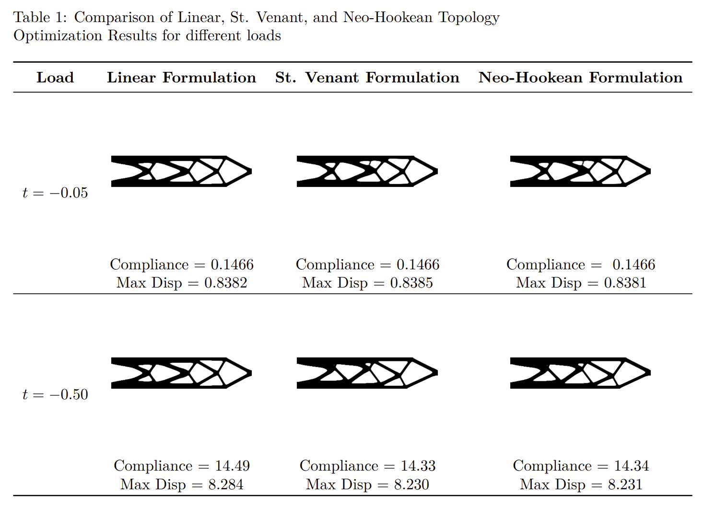

# top_optim
**topoptim** is a personal research fork of [FEniTop](https://github.com/missionlab/fenitop), an open-source topology optimization program built on [FEniCSx](https://fenicsproject.org). This project extends the original framework of **FEniTop** to include non-linear models, including the St. Vernant and NeoHookean models. 

The program consists of an input file which prescribes the FEM setup and optimization settings, and six different modules which perform the optimization routine including: 
- **topopt.py** Runs the full optimization loop by calling on other modules and creates a results folder.
- **fem.py** Utilizes FEniCSx to form an FEA problem, including defining the material interpolation, boundary conditions, weak form equations, and optimization related variables.
- **parameterize.py** Defines **DensityFilter** class which applies a PDE-based Helmholtz filter to the raw density field, and **Heaviside** class which sharpens the filtered field via smooth projection.
- **sensitivity.py** Computes the full derivative of compliance with respect to the design variable, density, via the adjoint method.    
- **optimize.py** Employs the Optimality Criteria (OC) or Method of Moving Asymptotes (MMA) optimizers to update the design variables based off of the sensitivities.  
- **utility.py** Provides auxiliary functions, including plotters, communicators, and classes to wrap and solve linear and non-linear problems.

#Implementation of Non-Linear Models
The non-linear models were implemented into the **FEniTop** framework with only a few additions:
- Update program to use new version of FEniCSx 0.9.0
- Creation of **WrapNonlinearProblem** class to wrap a residual problem and solve iteratively.
- Changed definition of compliance from internal strain energy to external work.
- Implementation of incremental load stepping for nonlinear problems, where tractions are scaled progressively across a defined number of steps. At each step, the nonlinear problem is solved and updated via **WrapNonlinearProblem.solve_fem()**, improving stability and convergence under large deformations.
- New sensitivity class which can be applied to both linear and nonlinear problems, utilizing automatic differentiation and an adjoint sensitivity solve via a transposed linear system  to assemble the full derivative. 

#Optimization Response
To analyze the behavior of nonlinear models against the linear elastic model, a comparison test is performed. Each model solves the same problem with identical input parameters and settings. Three different problems are setup, each with increasing tractions to highlight how these models change with load magnitude when all other variables are held constant.

###Problem Setup
The problem consists of a 2D beam, fixed on the left edge and a traction applied in the downward direction over a small length on the right side. 


###Results


# How to access FEniTop

### Installation of the coding environment
FEniTop relys on the coding evironment of FEniCSx and a few other dependencies.
To install the coding environment, we can follow the procedure below.

#### Short version

- Install [FEniCSx](https://github.com/FEniCS/dolfinx) of version 0.7.3.
- Install [PyVista](https://github.com/pyvista/pyvista).
- Install Xvfb with `apt-get -qq update && apt-get -y install libgl1-mesa-dev xvfb`.

#### Detailed version

To install the coding environment in one shot, we recommend to use [Docker](https://www.docker.com/) containers. Take Windows 11 as an example, we can follow the steps below.

- Run `wsl --install` in Windows PowerShell, which automatically enables the features necessary to run [Windows Subsystem for Linux (WSL)](https://learn.microsoft.com/en-us/windows/wsl/install) and installs the Ubuntu distribution of Linux.
- Install [Docker Desktop](https://www.docker.com/products/docker-desktop) and [Visual Studio Code](https://code.visualstudio.com/).
- Start Docker Desktop, select `settings`-`Resources`-`WSL integration`, and activate Ubuntu we just installed if not activated.
- Start Ubuntu and run `docker pull jiayingqi/dolfinx-fenitop`, which pulls an image containing all required packages (FEniCSx+PyVista+Xvfb).
- Use the pulled image to create a Docker container by running `docker run -it --name fenitop_container --shm-size=1024m -v /mnt/d/windows_folder_name:/shared jiayingqi/dolfinx-fenitop` in Ubuntu. Change `d` to the actual disk and change `windows_folder_name` to the acutual folder.
- Start Visual Studio Code and select `Extensions` (`Ctrl`+`Shift`+`X`). Search for and install `Docker` and `Remote Development` extensions.
- Select `Docker` extension we just installed, and we should see a container named as `fenitop_container`. Right click on this container and select `Start` and then `Attach Visual Studio Code`.
- A new window will pop up. In this window, select `File`-`Open Folder` (`Ctrl`+`K` and then `Ctrl`+`O`) and open the `shared` folder.
- Now we have successfully created the coding environment inside this folder. A good thing is whatever changes you make in this `shared` folder will be synchronized to `windows_folder_name` and vice versa.

### Installation of FEniTop
To install FEniTop, simply execute the command in your terminal (such as the terminal of Visual Studio Code).
```
git clone https://github.com/missionlab/fenitop
```

### How to run FEniTop scripts
To run FEniTop scripts, simply execute the following commands in your terminal.

- 2D cantilever beam with a structured mesh: `mpirun -n 8 python3 scripts/beam_2d.py`


## Authors, sponsors, and citation

### Authors
- Yingqi Jia (yingqij2@illinois.edu)
- Chao Wang (chaow4@illinois.edu)
- Xiaojia Shelly Zhang (zhangxs@illinois.edu)

### Sponsors
- U.S. National Science Foundation (NSF) EAGER Award CMMI-2127134
- U.S. Defense Advanced Research Projects Agency (DARPA) Young Faculty Award (N660012314013)
- NSF CAREER Award CMMI-2047692
- NSF Award CMMI-2245251

### Citation
- Jia, Y., Wang, C. & Zhang, X.S. FEniTop: a simple FEniCSx implementation for 2D and 3D topology optimization supporting parallel computing. Struct Multidisc Optim 67, 140 (2024). https://doi.org/10.1007/s00158-024-03818-7

```
@article{jia_fenitop_2024,
  title = {{FEniTop}: A Simple {FEniCSx} Implementation for {2D} and {3D} Topology Optimization Supporting Parallel Computing},
  shorttitle = {FEniTop},
  author = {Jia, Yingqi and Wang, Chao and Zhang, Xiaojia Shelly},
  year = {2024},
  month = aug,
  journal = {Structural and Multidisciplinary Optimization},
  volume = {67},
  number = {140},
  issn = {1615-1488},
  doi = {10.1007/s00158-024-03818-7},
}
```
